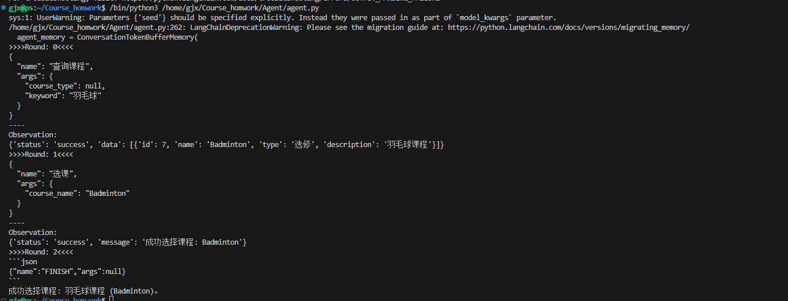

## 实现方案

### 安装&import 依赖

```python
import json
import sys
from typing import List, Optional, Dict, Any, Tuple, Union
from uuid import UUID

from langchain.memory import ConversationTokenBufferMemory
from langchain.tools.render import render_text_description
from langchain_core.callbacks import BaseCallbackHandler
from langchain_core.language_models import BaseChatModel
from langchain_core.output_parsers import PydanticOutputParser, StrOutputParser
from langchain_core.outputs import GenerationChunk, ChatGenerationChunk, LLMResult
from langchain_core.prompts import PromptTemplate
from langchain_core.tools import StructuredTool
from langchain_openai import ChatOpenAI

from pydantic import BaseModel, Field, ValidationError

import tiktoken


import os
```

### 定义tools

+ tools函数均由大模型生成

```python
# 模拟课程数据
courses = [
    {"id": 1, "name": "Introduction to Computer Science", "type": "必修", "description": "基础计算机科学课程"},
    {"id": 2, "name": "Data Structures", "type": "必修", "description": "数据结构与算法"},
    {"id": 3, "name": "Database Systems", "type": "选修", "description": "数据库设计与管理"},
    {"id": 4, "name": "Software Engineering", "type": "选修", "description": "软件开发流程与方法"},
    {"id": 5, "name": "Advanced Programming", "type": "选修", "description": "高级编程技术"},
    {"id": 6, "name": "Sports and Health", "type": "选修", "description": "体育与健康"},
    {"id": 7, "name": "Badminton", "type": "选修", "description": "羽毛球课程"},
]

# 用户已选课程
selected_courses = []

def query_courses(course_type: str = None, keyword: str = None) -> dict:
    """
    查询课程，支持按类型和关键词筛选
    :param course_type: 课程类型（必修/选修）
    :param keyword: 关键词
    :return: 符合条件的课程列表（dict 格式）
    """
    result = courses.copy()
    
    if course_type:
        result = [course for course in result if course["type"] == course_type]
    
    if keyword:
        result = [course for course in result if keyword.lower() in course["description"].lower()]
    
    return {
        "status": "success",
        "data": result
    }

def select_course(course_name: str) -> dict:
    """
    选课
    :param course_name: 课程名称
    :return: 选课结果（dict 格式）
    """
    course = next((course for course in courses if course["name"].lower() == course_name.lower()), None)
    
    if not course:
        return {
            "status": "error",
            "message": "课程不存在，请检查课程名称。"
        }
    
    if course in selected_courses:
        return {
            "status": "error",
            "message": "您已经选择了这门课程。"
        }
    
    selected_courses.append(course)
    return {
        "status": "success",
        "message": f"成功选择课程: {course['name']}"
    }

def delete_course(course_name: str) -> dict:
    """
    删除已选课程
    :param course_name: 课程名称
    :return: 删除结果（dict 格式）
    """
    course = next((course for course in selected_courses if course["name"].lower() == course_name.lower()), None)
    
    if not course:
        return {
            "status": "error",
            "message": "您没有选择这门课程，无法删除。"
        }
    
    selected_courses.remove(course)
    return {
        "status": "success",
        "message": f"成功删除课程: {course['name']}"
    }

def list_selected_courses() -> dict:
    """
    列出已选课程
    :return: 已选课程列表（dict 格式）
    """
    return {
        "status": "success",
        "data": selected_courses
    }

query_courses_tool=StructuredTool.from_function(
    func=query_courses,
    name="查询课程",
    description="查询课程，支持按类型和关键词筛选"
)

select_course_tool=StructuredTool.from_function(
    func=select_course,
    name="选课",
    description="选课。返回选课结果"
)

delete_course_tool=StructuredTool.from_function(
    func=delete_course,
    name="退课",
    description="删除已选课程,返回选课结果"
)
list_selected_courses_tool=StructuredTool.from_function(
    func=list_selected_courses,
    name="列出已选课程",
    description="列出已选课程。返回已选课程列表"
)

finish_placeholder = StructuredTool.from_function(
    func=lambda: None,
    name="FINISH",
    description="用于表示任务完成的占位符工具"
)

tools = [query_courses_tool,select_course_tool, delete_course_tool, list_selected_courses_tool, finish_placeholder]
```

### Prompt

任务prompt和最终prompt

```python
prompt_text = """
你是强大的AI火车票助手，可以使用工具与指令查询并购买火车票

你的任务是:
{task_description}

你可以使用以下工具或指令，它们又称为动作或actions:
{tools}

当前的任务执行记录:
{memory}

按照以下格式输出：

任务：你收到的需要执行的任务
思考: 观察你的任务和执行记录，并思考你下一步应该采取的行动
然后，根据以下格式说明，输出你选择执行的动作/工具:
{format_instructions}
"""

final_prompt = """
你的任务是:
{task_description}

以下是你的思考过程和使用工具与外部资源交互的结果。
{memory}

你已经完成任务。
现在请根据上述结果简要总结出你的最终答案。
直接给出答案。不用再解释或分析你的思考过程。
"""

```

### 一些工具类

```python
class Action(BaseModel):
    """结构化定义工具的属性"""
    name: str = Field(description="工具或指令名称")
    args: Optional[Dict[str, Any]] = Field(description="工具或指令参数，由参数名称和参数值组成")


class MyPrintHandler(BaseCallbackHandler):
    """自定义LLM CallbackHandler，用于打印大模型返回的思考过程"""
    def __init__(self):
        BaseCallbackHandler.__init__(self)

    def on_llm_new_token(
            self,
            token: str,
            *,
            chunk: Optional[Union[GenerationChunk, ChatGenerationChunk]] = None,
            run_id: UUID,
            parent_run_id: Optional[UUID] = None,
            **kwargs: Any,
    ) -> Any:
        end = ""
        content = token + end
        sys.stdout.write(content)
        sys.stdout.flush()
        return token

    def on_llm_end(self, response: LLMResult, **kwargs: Any) -> Any:
        end = ""
        content = "\n" + end
        sys.stdout.write(content)
        sys.stdout.flush()
        return response
class ChatOpenAIIn05(ChatOpenAI):
    def _get_encoding_model(self) -> Tuple[str, tiktoken.Encoding]:
        """
        Override the method to return a hardcoded valid model and its encoding.
        """
        # Set the model to a valid one to avoid errors
        model = "gpt-3.5-turbo"
        return model, tiktoken.encoding_for_model(model)
```

### Agent定义

```python
class MyAgent:
    def __init__(
            self,
            llm: BaseChatModel = ChatOpenAIIn05(
                model="gpt-4o-mini", # agent用GPT4效果好一些
                temperature=0,
                model_kwargs={
                    "seed": 42
                },
            ),
            tools=None,
            prompt: str = "",
            final_prompt: str = "",
            max_thought_steps: Optional[int] = 10,
    ):
        if tools is None:
            tools = []
        self.llm = llm
        self.tools = tools
        self.final_prompt = PromptTemplate.from_template(final_prompt)
        self.max_thought_steps = max_thought_steps # 最多思考步数，避免死循环
        self.output_parser = PydanticOutputParser(pydantic_object=Action)
        self.prompt = self.__init_prompt(prompt)
        self.llm_chain = self.prompt | self.llm | StrOutputParser() # 主流程的LCEL
        self.verbose_printer = MyPrintHandler()

    def __init_prompt(self, prompt):
        return PromptTemplate.from_template(prompt).partial(
            tools=render_text_description(self.tools),
            format_instructions=self.__chinese_friendly(
                self.output_parser.get_format_instructions(),
            )
        )

    def run(self, task_description):
        """Agent主流程"""
        # 思考步数
        thought_step_count = 0

        # 初始化记忆
        agent_memory = ConversationTokenBufferMemory(
            llm=self.llm,
            max_token_limit=4000,
        )
        agent_memory.save_context(
            {"input": "\ninit"},
            {"output": "\n开始"}
        )

        # 开始逐步思考
        while thought_step_count < self.max_thought_steps:
            print(f">>>>Round: {thought_step_count}<<<<")
            action, response = self.__step(
                task_description=task_description,
                memory=agent_memory
            )

            # 如果是结束指令，执行最后一步
            if action.name == "FINISH":
                break

            # 执行动作
            observation = self.__exec_action(action)
            print(f"----\nObservation:\n{observation}")

            # 更新记忆
            self.__update_memory(agent_memory, response, observation)

            thought_step_count += 1

        if thought_step_count >= self.max_thought_steps:
            # 如果思考步数达到上限，返回错误信息
            reply = "抱歉，我没能完成您的任务。"
        else:
            # 否则，执行最后一步
            final_chain = self.final_prompt | self.llm | StrOutputParser()
            reply = final_chain.invoke({
                "task_description": task_description,
                "memory": agent_memory
            })

        return reply

    def __step(self, task_description, memory) -> Tuple[Action, str]:

        """执行一步思考"""
        response = ""
        for s in self.llm_chain.stream({
            "task_description": task_description,
            "memory": memory
        }, config={
            "callbacks": [
                self.verbose_printer
            ]
        }):
            response += s

        action = self.output_parser.parse(response)
        return action, response

    def __exec_action(self, action: Action) -> str:
        observation = "没有找到工具"
        for tool in self.tools:
            if tool.name == action.name:
                try:
                    # 执行工具
                    observation = tool.run(action.args)
                except ValidationError as e:
                    # 工具的入参异常
                    observation = (
                        f"Validation Error in args: {str(e)}, args: {action.args}"
                    )
                except Exception as e:
                    # 工具执行异常
                    observation = f"Error: {str(e)}, {type(e).__name__}, args: {action.args}"

        return observation

    @staticmethod
    def __update_memory(agent_memory, response, observation):
        agent_memory.save_context(
            {"input": response},
            {"output": "\n返回结果:\n" + str(observation)}
        )

    @staticmethod
    def __chinese_friendly(string) -> str:
        lines = string.split('\n')
        for i, line in enumerate(lines):
            if line.startswith('{') and line.endswith('}'):
                try:
                    lines[i] = json.dumps(json.loads(line), ensure_ascii=False)
                except:
                    pass
        return '\n'.join(lines)

```

### 测试

```python
if __name__ == "__main__":
    my_agent = MyAgent(
        tools=tools,
        prompt=prompt_text,
        final_prompt=final_prompt,
    )

    task = "选择羽毛球课"
    reply = my_agent.run(task)
    print(reply)
```

### 输出结果



